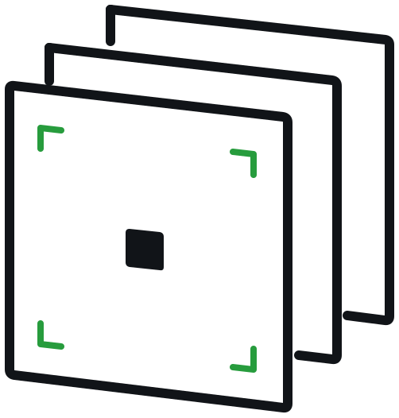

<p align="center">
  
</p>

<h1 align="center">Viewport</h1>

<p align="center">
  Privacy-first runtime infrastructure for coding agents.
</p>

<p align="center">
  <a href="https://getviewport.com">Website</a>
  ·
  <a href="https://docs.getviewport.com">Docs</a>
  ·
  <a href="https://www.npmjs.com/package/@viewportai/daemon">npm</a>
</p>

Viewport is the open-source runtime layer behind Viewport: a daemon that runs
where your coding agents run, plus a relay that connects those machines to the
hosted or self-hosted control plane.

The daemon is the trusted edge. It supervises Claude Code, Codex, and custom
terminal-based agents; streams session state; handles pairing; and performs
local decrypt/resolve work for encrypted plans and context when configured. The
relay routes WebSocket traffic between authenticated clients and paired daemons.

Viewport is currently in alpha. The daemon and relay are usable, but product
surfaces and hosted workflows are still changing.

## What This Repo Contains

| Path | Purpose |
| --- | --- |
| [`packages/daemon`](packages/daemon) | `vpd`, the local trusted-edge daemon and CLI. |
| [`services/relay`](services/relay) | Stateless WebSocket relay for remote daemon connectivity. |
| [`integration`](integration) | End-to-end and protocol conformance harnesses. |

The hosted web app and server API live outside this open-source runtime repo.
Public product and security docs live at
[docs.getviewport.com](https://docs.getviewport.com).

## Install

For the managed alpha:

```bash
npm install -g @viewportai/daemon
vpd pair
```

`vpd pair` creates a short-lived pairing code, opens the Viewport pairing page,
and waits for you to approve the machine in the browser. After approval, the
daemon stores the workspace-scoped relay credentials in `~/.viewport/` and
restarts so the machine can connect.

Bind each repo that should stream sessions or use workspace context:

```bash
cd /path/to/repo
vpd bind .
```

`vpd bind .` writes a gitignored local binding under `.viewport/`. That binding
tells the daemon which Viewport workspace owns runs, plans, and context proposed
from that repo.

Useful checks:

```bash
vpd status
vpd doctor
vpd status --json
```

## Fresh User Flow

1. Create a Viewport account and workspace in the web app.
2. Install the daemon: `npm install -g @viewportai/daemon`.
3. Pair the machine: `vpd pair`.
4. Approve the pairing request in the browser.
5. Bind a repo: `vpd bind .`.
6. Open Claude Code, Codex, or your custom terminal agent in that repo.

After binding, sessions can stream to Viewport when the daemon is online. Plans
created through the installed Viewport hooks can open as encrypted drafts.
Context proposals resolve against the workspace selected by the repo binding.

## Architecture

Viewport separates the runtime into three planes:

| Plane | Role |
| --- | --- |
| Trusted edge | The local or remote daemon. It owns machine-local state, agent processes, and runtime decrypt operations. |
| Relay | WebSocket transport. It routes authenticated frames and should not be treated as an application database. |
| Control plane | Identity, workspace membership, pairing approval, metadata, and policy. |

The server stores product metadata needed for collaboration. Encrypted plan and
context bodies are stored as ciphertext when using trusted-edge flows. Hosted
web can render plaintext only after a paired daemon returns it for an active,
short-lived review session.

## Local Development

Install dependencies once:

```bash
npm install
```

Run the daemon from this checkout:

```bash
npm run daemon
vpd start --foreground
```

Common checks:

```bash
npm run daemon:check
npm run relay:check
npm run daemon:install:verify
```

`npm run daemon` builds and links `@viewportai/daemon` globally, so normal
`vpd ...` commands point at this checkout until you reinstall or relink.

For package-level details, see:

- [Daemon README](packages/daemon/README.md)
- [Daemon configuration](packages/daemon/docs/configuration.md)
- [Daemon security notes](packages/daemon/docs/security.md)
- [Testing guide](packages/daemon/docs/testing.md)
- [Release checklist](packages/daemon/docs/releasing.md)

## Self-Hosting

The daemon and relay are open source. A self-hosted deployment also needs a
compatible server API/control plane for identity, pairing, workspace policy, and
metadata.

Relay example:

```bash
docker build -t viewport-relay services/relay
docker run --rm -p 7781:7781 \
  -e HOST=0.0.0.0 \
  -e RELAY_MODE=prod \
  -e SERVER_URL=https://api.example.com \
  -e RELAY_PUBLIC_WS_BASE_URL=wss://relay.example.com/ws \
  viewport-relay
```

See the self-hosting docs:
[docs.getviewport.com/self-host/overview](https://docs.getviewport.com/self-host/overview).

## Security Posture

Viewport’s strongest privacy guarantees come from keeping sensitive runtime
operations on paired trusted edges. This repo avoids claiming that hosted web is
zero-knowledge: if hosted web renders plaintext, the browser is part of the
trusted display path for that session.

The public security docs describe the current trust split and known limits:
[docs.getviewport.com/concepts/trust-and-privacy](https://docs.getviewport.com/concepts/trust-and-privacy).

## License

[Apache 2.0](LICENSE)
